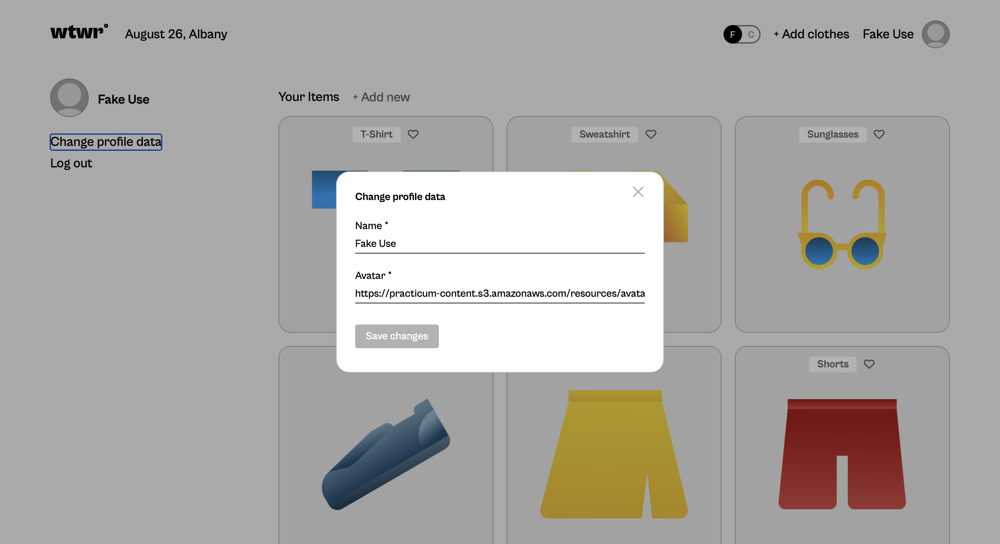
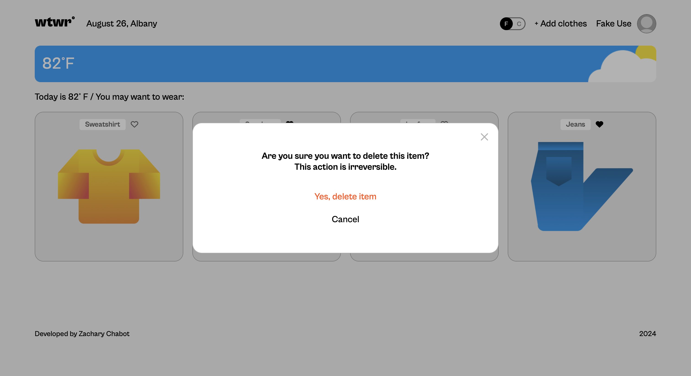
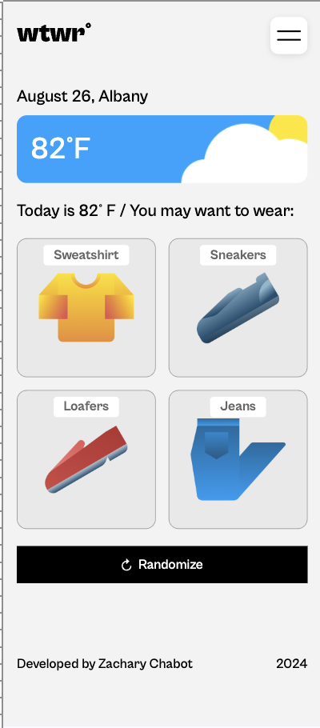

# Project Name

WTWR (What To Wear)

## Description

What not to wear is an application that provides clothing options based on the current weather in a given area. Users can create an account and upload their own clothing items with a picture, a name, and what type of weather the clothing is best for. Users that are signed in can view and like other users clothing items that are suited for the current weather on the main page. Each user can only like each clothing item once. Users can only add items when they are logged in and can only delete the items that they have posted. There is a seperate profile page for signed in useres where they can view a complete list of the clothing items accosiated with their account and edit their profile information.
Users will stay logged in for 7 days, or until they sign out.

## Technologies and Techniques

- HTML5
- CSS
- Javascript
- JSX
- React.js
- Node.js
- React-Router
- Local Storage
- API Requests (from)

## Backend

https://wtwrzc.port0.org

### Images

